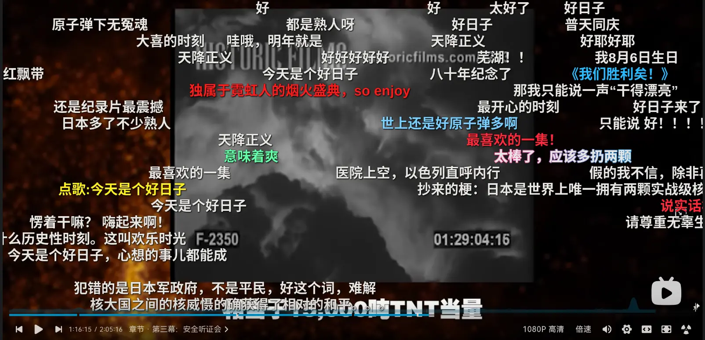

## 什么时候看得

相信很多人已经看过奥本海默了，我记得我是在奥本海默上映后周末去的，说真的我所在地的 IMAX 屏幕不是很大，是属于较小的那种，好在它是激光的。
视觉效果还是非常不错的。

## 观看当时的感受

我只能说，在电影开始播放的那一刻，从 基里安·墨菲 的那个引人坠落的眼睛开始，我就一同跟随故事前进，我的注意力被完全吸引，随着故事的跌宕起伏，
随着核弹的爆炸和史诗般的音乐一次次被推上高潮，直到结束我才感觉心跳如此快速。

无论是基里安·墨菲饰演的奥本海默还是小罗伯特·唐尼饰演的施特劳斯都有非常细致入微的刻画。不过我觉得最出彩的还是奥本海默的妻子凯瑟琳，听证会受审的那一段
简直出彩。

这大概就是电影工业带来的魅力。

## 观看结束后的感受

有趣的是，观看了两次奥本海默，一次自己看得，一次带着对象看得。不得不说，即便是第二次观看依然被紧张紧凑的研发和听证会触动。

可能这么说有点矫情。奥本海默依然是我去年看过的最好的电影之一，其次是蜘蛛侠：纵横宇宙和铃芽之旅。

## 解析中弹幕对小男孩爆炸时的评论

因为奥本海默是个历史电影，而且我有很多事情并不了解，一般情况下，我看到一个好看的电影我就会比较好奇幕后故事，并且我会更详细的了解视听语言。，
所以我观看了一些有关奥本海默的解析视频。

我在看奥本海默解析的时候，看到原子弹试爆成功，小男孩和胖子被送往日本投放。最后在 杜鲁门 广播播报中，
人们知道了原子弹这个恐怖的大规模杀伤性武器在日本上空引爆成功。无论日本当时的军国主义，还是反法西斯的行动，这都是历史中的行为。
我们暂且不讨论这两个原子弹是否加速日本投降，还是他们是否真的会一亿玉碎。不过原子弹这个悬垂在所有国家上空的达摩克利斯之剑真的刺落。
而这个恐怖的武器在引爆当天就杀死了 **66000** 人。我不确定这 **66000** 人中是有多少群众，据维基百科中所说，
其中最多只有 **24158** 名士兵。那剩下的 **41842** 人就是无辜群众。对于这 **4 万**人，这似乎是一件无法理解的恐怖，毕竟他们一瞬间就消失了，
化为地面上或墙壁上的一片黑影。

**这一瞬间不是死了 4 万人，而是人的死亡发生了 4 万次！**

当然，我不是什么悲天悯人的大圣母，日本军队在中国犯下了不可饶恕的罪行，这是事实，没人可以更改。但是在日本本土的群众并没有犯下屠杀的罪孽，
你可以说他们在本土提供弹药补给等物资给前线。那也是该死的战争罪犯们要求他们做的，也许他们并没有选择的权利。如果他们是自愿的，满心欢喜的想要前线的士兵多
杀一个人，多抢夺一些资源，那他们一样该死。

战争不是目的，战争只是获取资源和消耗资源的手段。

而我在弹幕中看到的重点是。**有大量的人为原子弹的爆炸感到欢欣鼓舞，感到似乎应该多死一些人，而更极端的人甚至觉得整个日本都应该沦为烈焰火海。**
这都让我觉得疑惑，**明明在电影中你已经体验到死神降临时的威严，也看到了奥本海默在原子弹爆炸后的庆功会上听着轰鸣的跺脚声中精神恍惚。 看到众多科学家在听到杜鲁门播报死神降临人间时的沉默，前一秒人们陷入了极大的喜悦，却突然转变成为沉默。**
难道这一切无法感染到他们么？ 难道他们无法理解原子弹是多么地恐怖？正巧现在俄罗斯与乌克兰正在打仗，俄罗斯多次威胁将启动核战争。
核战争的死亡般的乌云正在酝酿。 而拴住达摩克里斯之剑的细绳也在不断崩解，也许有一天，它将瞬间落下。
**而我们也有可能带着我们记忆和我们所有珍爱的、在乎的、喜爱的人或事物成为地面上的黑影，这不应该恐惧或悲悯么？人类是有悲悯之心的！**

而其中我最难理解的是弹幕中的“原子弹下无冤魂”。这简直等同于比你强的人可以无视一切的摧毁你而不用感受到一点悲悯。

正如影片中琼·塔特洛克所说的：

> **你在我的生命中进进出出，却不必告诉我为什么，这就是权利。**

## 为什么人们似乎越来越极端

我的兴趣的东西非常多，包括科技、电影、动漫等各种东西。然而令我不解的是，我经常在弹幕中或者评论区看到极端言论，包括但不限于日本毁灭、美国该死等言论。
而且愈演愈烈，似乎已经变成了一种政治正确，只要你不说上一句小日本，你就不再是中国人。

**我当然知道造成这种结果的原因是什么。** 我想大家都知道。

但是，我依然很困惑，这似乎泯灭了人性中最光芒的存在 —— **感性**。似乎，这些人的感性都消失了，
他们似乎无法体会到别人的感受。这最直接的结果就是，他们没法感同身受，无法理解别人的痛苦，越来越冷漠了。

而且，我现在经常可以在网上发现令人咋舌的话语。
例如：[在分享生日的视频里让对方重开，你们觉得自己很幽默吗？](https://mp.weixin.qq.com/s/hSsiIHHOATrAyCKwhHs5kw)。
（我们这里不讨论这件事是否有人带节奏，或者其他情况，我们只讨论这件事情本身。）

可以看得出来，他们似乎真的这么想，而且不是跟风。树立一个公共仇敌真的是一个非常好的方式，可以让负面情绪和自己最重要地**思考**一起消失。
不断的宣传洗脑，最后让人沦为新闻的奴隶。

当然，也许是我多愁善感，是我太敏感了。

## 最后

> Can you hear the music?